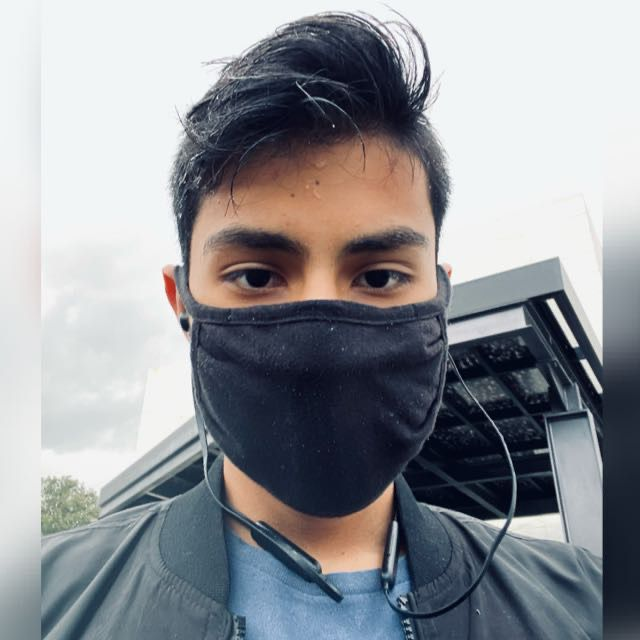

## Introduction

Hi! Welcome to mi CAS page, here I will be displaying my projects and
actions that I've made during my IB semesters.

## Personal Information

Mi name is Jorge Andrés Castillo Ramírez, I was born on the City of 
Mexico in the 12th of July of 2004. 

## My personal hobbies 
- Painting with acrilics, watercolors, and oil.
- Swimming
- Drawing
- Calisthenics
- Photography
- Travelling

## Reflection: Plastic Arts

During the transcurse of these last semesters and specially my fist IB year, I have
been focusing on different artistics proyects that involve different thechinques, methods,
and themes.

The area of creativity has been a great opportunity to develop my skills on activities and 
hobbies that I have passion for. Trough art I am able to find different perspectives on the
world that I would not find either way. Art is something that forces you to think outside the
box, explore topics that may be uncomfortable but that offer a variety of ideas and knowledge.
